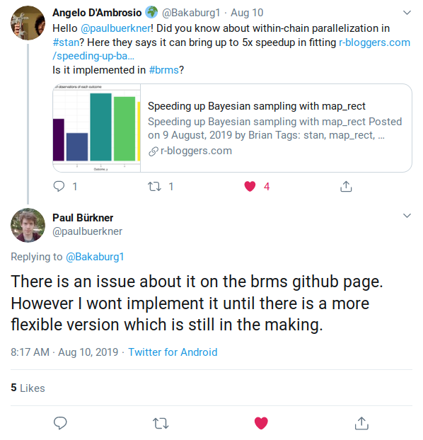

```{r setup, include=FALSE}
knitr::opts_chunk$set(
  echo = TRUE,
  comment = NA,
  message = FALSE,
  warning = FALSE,
  error = TRUE,
  # cache = TRUE,
  dev = "svglite"
)

library(tidyverse)
library(scales)
library(here)

library(kableExtra)

library(rstan)
library(tidybayes)
library(brms)

theme_set(theme_bw())

options(mc.cores = parallel::detectCores())
rstan_options(auto_write = TRUE)
```

```{r functions, include=FALSE}
logistic <- function(p) log(p) - log(1 - p)
inv_logistic <- function(x) 1 / (1 + exp(-x))
```


# Why?

## 4x speedup per chain!

* Full Bayes can be sloooooow 🐢
* Adding more chains is easy 🤩 
* You can also run a single chain in parallel! 🤓

<aside class="notes">
• Assuming 4 cores per chain
</aside>


<div style="visibility:hidden;display:none">
$$
   \DeclareMathOperator{\dbinomial}{Binomial}
   \DeclareMathOperator{\dbernoulli}{Bernoulli}
   \DeclareMathOperator{\dpoisson}{Poisson}
   \DeclareMathOperator{\dnormal}{Normal}
   \DeclareMathOperator{\dt}{t}
   \DeclareMathOperator{\dcauchy}{Cauchy}
   \DeclareMathOperator{\dexponential}{Exp}
   \DeclareMathOperator{\duniform}{Uniform}
   \DeclareMathOperator{\dgamma}{Gamma}
   \DeclareMathOperator{\dinvgamma}{InvGamma}
   \DeclareMathOperator{\invlogit}{Logistic^{-1}}
   \DeclareMathOperator{\logistic}{Logistic}
   \DeclareMathOperator{\ddirichlet}{Dirichlet}
   \DeclareMathOperator{\dbeta}{Beta}
$$
</div>


## Useful examples

* [Sane indexing](https://mc-stan.org/docs/2_19/stan-users-guide/example-hierarchical-logistic-regression.html)
* [Different number of observations per level](https://mc-stan.org/docs/2_19/stan-users-guide/ragged-inputs-and-outputs.html)
* Hierarchical
* Can use a brms workflow

[](https://twitter.com/dan_p_simpson/status/1184135201854763008)

<aside class="notes">
• Not many examples reflect my typical usecase
* Does pymc do this?
</aside>

## Caveats

* Requires changes to stan code
* You'll need a whole bunch of cores
* [brms won't implement it](https://github.com/paul-buerkner/brms/issues/564) until stan 3 



## Today

* We'll map a (simple) hierarchical logistic regression
* We'll turn it into a brms object
* Break up into groups to get people setup up with map_rect

<aside class="notes">
• whoever is interested
</aside>


# The Idea


## Usual HMC


<aside class="notes">
• Sequential
• Need all of one block before moving on
</aside>


## Mapped HMC


<aside class="notes">
* you can break down your dataset into shards, 
* calculate the log-likelihood on each shard in parallel, 
* sum up the log-likelihood of each shard at the end.
* vectorisation vs parallelisation
</aside>


## Logistic regression

$$
\begin{align}
  y_i 
  &\sim 
  \dbernoulli(p_i)
  \\
  p_i
  &=
  \logistic^{-1}(\mu + \sigma \alpha_i)
  \\
  \mu
  &\sim
  \dnormal(0, 1) \quad \text{(intercept)}
  \\
  \alpha_i
  &\sim
  \dnormal(0, 1) \quad \text{(random effects)}
  \\
  \sigma
  &\sim
  \dnormal_+\left(0, 0.5 \right) 
\end{align}
$$

<aside class="notes">
* this is the model for today
</aside>


## Stan: logistic regression

```stan
data {...}

parameters {...}

model {
  sigma ~ normal(0, 0.5); 
  alpha ~ normal(0, 1);
  mu ~ normal(0, 1);
  for (i in 1:N) {
    y ~ bernoulli_logit_lpmf(
      mu + sigma * alpha[level[i]]
    );
  }
}
```

<aside class="notes">
* this is the stan implementation
* this is for illustration...there are more efficient ways
</aside>


## map_rect

See [stan code](./models/logistic_regression_mapped.stan).

<aside class="notes">
* create shards = transformed data
* function for each shard = functions
* sum result (reduce) = model
</aside>


# Setup

## Makevars


```
CXX14FLAGS = -O3 -march=native -mtune=native
CXX14FLAGS += -fPIC
CXX14FLAGS += -DSTAN_THREADS
CXX14FLAGS += -pthread
```

Your `~/.R/Makevars` file should have threads enabled. Check out the [official docs for more info](https://github.com/stan-dev/math/wiki/Threading-Support).

<aside class="notes">
* i'm not familiar with C++
* just follow dev's advice
</aside>


## Environment

Tell Stan how many threads are available. 

```{bash n_threads}
nproc --all # number of threads available
```


```{r set_threads}
Sys.setenv(STAN_NUM_THREADS = 4)
```

Now we're ready to go!

# Example

## Simulate

```{r seed, include=FALSE}
set.seed(23204)
```
```{r data}
N <- 40000 # number of observations
L <- 20    # number of unique levels in our factor
intercept <- rnorm(1, 0, 1)
pop_stddev <- abs(rnorm(1, 0, 0.5))

df <- tibble(factr = 1:L) %>% 
  mutate(coef = rnorm(n(), 0, 1)) %>% 
  sample_n(N, replace = TRUE) %>% 
  mutate(
    intercept = intercept,
    pop_stddev = pop_stddev,
    linear = intercept + coef * pop_stddev,
    p = inv_logistic(linear),
    y = rbinom(n(), 1, p),
    factr = factr %>% as_factor() %>% fct_reorder(factr)
  ) 
```

<aside class="notes">
* data generating process
</aside>

## Data

```{r data_table, echo=FALSE}
df %>% 
  head() %>% 
  kable(caption = 'Sample output', digits = 3) %>% 
  kable_styling(bootstrap_options = c("striped", "hover", "responsive", "condensed"))
```

<aside class="notes">
* point out observed vs latent data
</aside>


## Unmapped model

```{r define_unmapped, cache=TRUE}
formula <- brmsformula(
  y ~ 1 + (1 | factr),
  family = bernoulli()
)
prior <- c(
  prior(normal(0, 1), class = 'Intercept'),
  prior(normal(0, 1), class = 'sd')
)

unmapped <- brms::brm(
  formula = formula,
  prior = prior,
  data = df,
  chains = 0 # just compile for now
)
```


<aside class="notes">
* just compile for now
</aside>

## Take a look inside

```{r model_unmapped}
unmapped$model
```

<aside class="notes">
* how to view underlying stan code
* pretty much same as before but with messier notation
</aside>


## Time it

```{r time_unmapped, cache=TRUE, results='hide'}
start_unmapped <- Sys.time()

model_unmapped <- unmapped %>% 
  update(
    chains = 1,
    iter = 5000,
    warmup = 1000,
    seed = 67029
  )

end_unmapped <- Sys.time()
duration_unmapped <- end_unmapped - start_unmapped
```

That took `r signif(duration_unmapped, 2)` minutes.

## Mapped stan code

```{r model_mapped, echo=FALSE}
"models/brms_logistic_regression_mapped.stan" %>% 
  here::here() %>% 
  read_lines() %>% 
  writeLines()
```

<aside class="notes">
* Same rewriting as before, just with brms notation
* data, parameters, generated quantities all stay the same
</aside>


## Make it a brms object

```{r define_mapped}
mapped_base <- "models/brms_logistic_regression_mapped.stan" %>% 
  here::here() %>% 
  rstan::stan_model()

data <- brms::make_standata(
  formula = formula, 
  data = df, 
  prior = prior
)

mapped_fit <- mapped_base %>% 
  rstan::sampling(
    data = data, 
    chains = 0 # just compile for now
  )

mapped <- unmapped %>% 
  list_modify(fit = mapped_fit)
```

<aside class="notes">
* Fit the model with rstan
* Switch the fit object in brms 
</aside>


## Time it

```{r time_mapped, cache=TRUE, results='hide'}
start_mapped <- Sys.time()

model_mapped <- mapped %>% 
  update(
    chains = 1, 
    iter = 5000,
    warmup = 1000,
    recompile = FALSE # keep our custom fit
  )

end_mapped <- Sys.time()
duration_mapped <- end_mapped - start_mapped
```

That took `r signif(duration_mapped, 2)` minutes 

<aside class="notes">
* recompiling will overwrite your fit object
* model just like any other brms model
</aside>


## Comparison

* Unmapped: `r signif(duration_unmapped, 2)` mins
* Mapped: `r signif(duration_mapped, 2)` mins
* Speedup: `r signif(as.numeric(duration_unmapped, units = 'mins') / as.numeric(duration_mapped, units = 'mins'), 2)`x

<aside class="notes">
* Speedup varies but approx linear in #threads
* how to optimise #shards? keep it as readable as possible
</aside>


## It's still BRMS!

Actual `intercept=``r signif(intercept, 3)` and `pop_stddev=``r signif(pop_stddev, 3)`.

```{r}
model_mapped %>% summary()
```


<aside class="notes">
* now use any brms function, e.g. summary, loo, marginal_effects, tidybayes
</aside>


# Resources

## Resources

* Richard McElreath: [simple logistic regression with cmdStan](https://github.com/rmcelreath/cmdstan_map_rect_tutorial).
* Ignacio: [broken](https://blog.ignacio.website/post/multithreading-and-map-reduce-in-stan/)?
* Stan user guide: [hierarchical logistic regression with balanced design](https://mc-stan.org/docs/2_19/stan-users-guide/map-reduce-chapter.html).
* My blog post: [hierarchical ordinal regression with rstan](https://www.briancallander.com/posts/map_rect/speeding_up_bayesian_sampling_with_map_rect.html).
